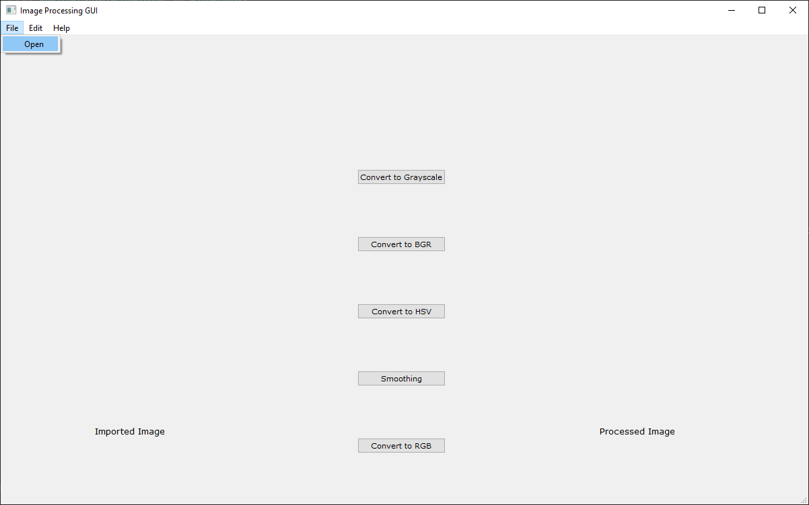
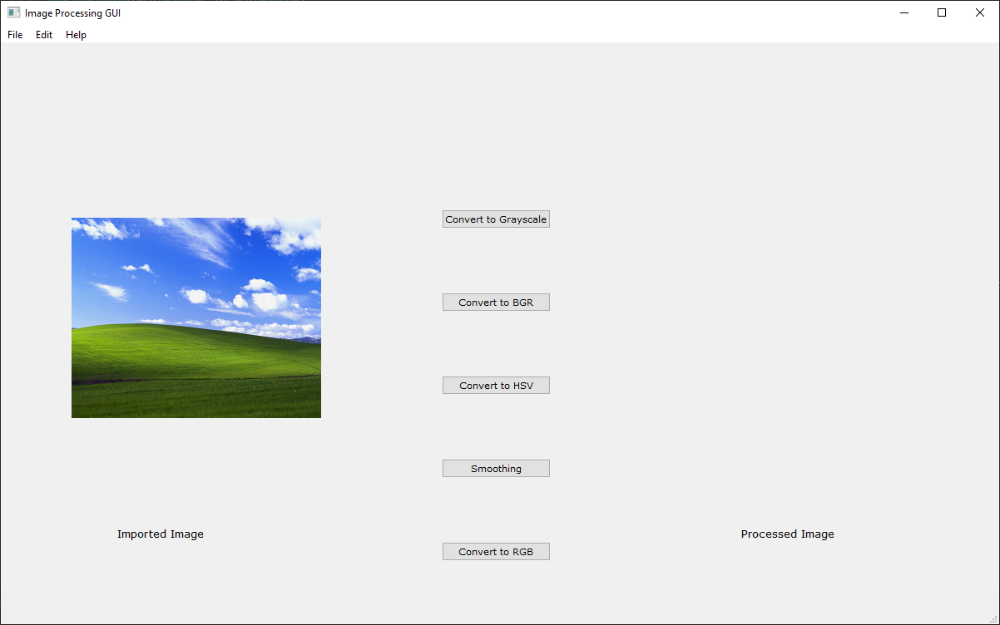
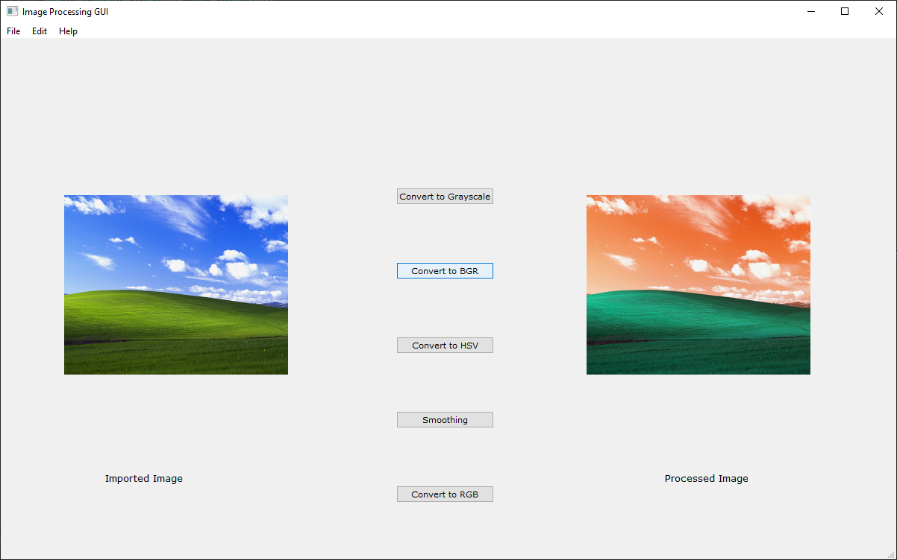

# GUI_ImageProcessing
A simple GUI app built with PyQt for image processing.

## Contents
* [Requirements](#Requirements)
* [User-Interface](#User-Interface)
* [Note](#Note)

## Requirements
* PyQt5, OpenCV, Numpy, Python=>3.4

## User-Interface
* Click on File -> Open to import an image.

* At the moment, five operations are supported:
  * Convert to Grayscale
  * Convert to BGR Colorspace
  * Convert to RGB Colorspace
  * Convert to HSV Colorspace
  * Smoothen an Image (Blur)

* Click on Edit -> Save Image to save the image.

## Note
Please be aware that this application was a small project for learning GUI development and may or may not be efficient or bug-free. 

